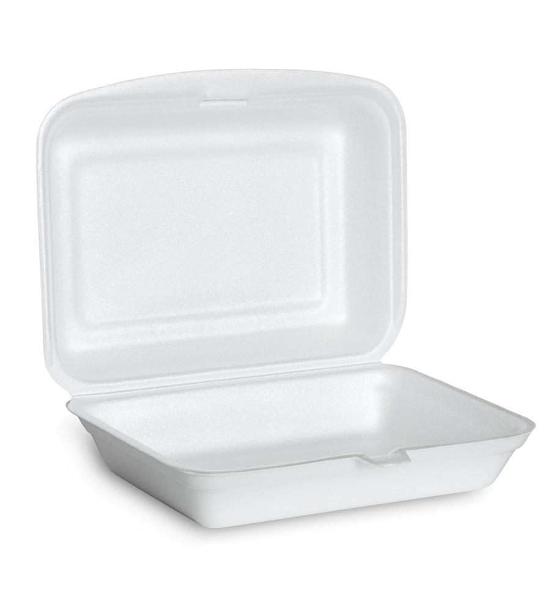

# Alternative Recycling Locations near the City of Livonia, Michigan
## Troop 76293 Girl Scout Silver Award project

## Styrofoam 
 

Some places that will take your Styrofoam are:
1.    [Goodwill Livonia/](https://www.goodwilldetroit.org/stores/)                                                                                                                                               12651 Middlebelt Rd - behind their building                                                 
2. [Recycle Ann Arbor](https://www.recycleannarbor.org/divisions/drop-off-station)                                                                      	                                                                2950 East Ellsworth Rd, Ann Arbor, MI 48108 734-971-7400 

## Aluminum
Some places that will take aluminum:
1. Livonia Drop-off Recycling Center 
2. [PADNOS Livonia Recycling](https://www.recycleannarbor.org/divisions/drop-off-station) 
3. [Haggerty Metals](https://www.haggertymetal.com/)

## Light Bulb
 Light bulbs can be recycled at:
1. [ERG Environmental Services](https://ergenvironmental.com/environmental-services/household-hazardous-waste-drop-off/)  13040 Merriman Rd, Livonia, MI 48150 734-437-9650
2. Home Depot
3. Lowes

## Batteries
Some places that take batteries are:
1. Batteries plus
2. Lowes
3. Home Depot

## Medical Waste
Some places to dispose of your medical waste are:
1. Wayne County Dept. of Environment 734-326-3936
2. Michigan EGLE Environmental Assistance Center 800-662-9278

## Tires
Your tires can be recycled at:
1. Most Auto Repair Shops
2. Bell Tire 734-961-4606
3. Lakeshore Tires and Auto 734-453-4570
4. Annually at the Livonia Department of Public Works

## Furniture/Mattress/Box Springs
Furniture, Mattresses, and box springs can be recycled at:
1. [Furniture Bank of Southeastern Mi](https://www.furniture-bank.org/donate/#donate-furniture)
2. [Goodwill](https://www.goodwillsemi.org/donate/donate-your-goods/)
3. [Salvation Army](https://satruck.org/donate/choose)
4. [Habitat for Humanity ReStore](https://www.habitat.org/restores/donate-goods)

## Used Medical Needles
Needles can be Disposed at:
1. [Safe Needle Disposal](https://safeneedledisposal.org/#google_vignette)
2. [ERG Environmental Services](https://ergenvironmental.com/environmental-services/household-hazardous-waste-drop-off/)  13040 Merriman Rd, Livonia, MI 48150 734-437-9650
## Motor Oil
Motor oil can be disposed of at:
1. [ERG Environmental Services](https://ergenvironmental.com/environmental-services/household-hazardous-waste-drop-off/)  13040 Merriman Rd, Livonia, MI 48150 734-437-9650 
2. Most Automotive Service Centers
3. Lakeshore Tire & Auto 734-45-4570
4. O’Reilly’s Auto Parts 734-228-4827
5. Plymouth Auto Care 734-455-6850

## Shoes/Clothes
Clothing and shoes can be recycled at:
1. Pickup in Livonia through [Simple Recycling](https://simplerecycling.com/)
2. Shoes and Clothing Donations Bin located in the parking lot of Villa Marie 313-980-4311
3. Shoes - [Fleet Feet](https://www.fleetfeet.com/s/semichigan/locations/northville?srsltid=AfmBOopWo4-EiYxkW45UmuPPtsyPVT-AeXYjTwxtDwhoy7YhAWjfyoEX) - Northville
4. Shoes - [Got Sneakers](http://www.gotsneakers.com)

## Plastic Bags
Some places that take plastic bags are:
1. Kroger
2. Home Depot
3. Lowes
4. Menards
5. Kohl's

## Bubble Wrap
Bubble wrap can be recycled at:
1. [Ann Arbor thrift shop](https://annarborthriftshop.org/)

## Car Seats and Boosters
Some places that takes car seats and boosters are:
1. [Recycle Ann Arbor](https://www.recycleannarbor.org/a-z-recycling-guide?page=1)
2. [Target](https://www.target.com/c/car-seat-trade-in-event-faq/-/N-ln7zc)
3. [Terracycle](https://shop.terracycle.com/en-US/products/baby-gear-zero-waste-pallet)

## Plastic caps
Plastic caps be recycled at:
1. American Legion Auxiliary